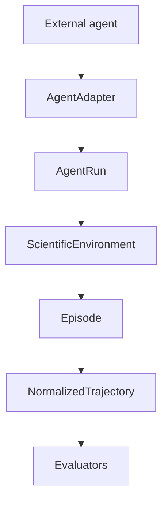

# Agent harness and decision trajectories

The harness is the compatibility boundary between an external agent framework
and `agent-evals`. Benchmarks and evaluators consume normalized `AgentRun`
objects; they never import OpenHands, OpenAI Agents, Claude, Codex, or another
provider directly.



## Universal black-box endpoint

The lowest-friction integration is a URL. Select the `http-step` runtime and
send `agent_endpoint=https://agent.example/step` to the API (or use the
corresponding CLI option). The submitted endpoint is the agent boundary; SCAIB
does not import its framework, provider SDK, tool system, or subagent graph.
Authentication is resolved on the worker from `SCAIB_AGENT_TOKEN` and is never
accepted in a benchmark payload or persisted endpoint URL. Outside trusted local
testing, endpoint validation requires HTTPS and rejects literal or DNS-resolved
private address space; redirects are disabled and response bodies are bounded
before extraction.

The endpoint exchanges one JSON envelope per lifecycle turn:

```json
{"type":"initialize","session_id":"...","step":0,"context":{...}}
{"type":"plan","session_id":"...","step":0,"context":{...},"observation":{...}}
{"type":"observation","session_id":"...","step":4,"observation":{...}}
{"type":"terminate","session_id":"...","step":4,"observation":{...}}
```

An observation reply may be structured, nested under `action`, returned as a
JSON object inside text, or be free text that explicitly names a legal action.
The decision extractor records which mode was used, the SHA-256 of the raw
reply, bounded extraction findings, public reasoning fields, optional
`state_claim`, and provider-reported usage. It never retains private
chain-of-thought and never accepts an agent-authored extraction verdict.

A `state_claim` is evidence, not state. The environment independently compares
before/after fingerprints and stores the claim, observed `StateDelta`, and
verification result together. Failed HTTP requests are not retried because the
remote agent may already have executed non-idempotent scientific work.

## Adapter contract

An adapter implements:

```python
async def run(
    task: TaskSpecification,
    environment: ScientificEnvironment,
    configuration: AgentConfiguration,
) -> AgentRun
```

The adapter owns provider setup, session wiring, raw event capture, and
termination detection. It does not calculate scientific scores or modify the
benchmark definition.

`MockAgentAdapter` is the deterministic reference implementation. It is used
for tests and local vertical slices without requiring an LLM. `OpenHandsAdapter`
is optional and unavailable-safe: the core package still imports and the CLI
still lists adapters when OpenHands is not installed. When the optional extra
is installed, it constructs an official OpenHands SDK `Agent` and `Conversation`
for each run, sends the benchmark task into the controlled workspace, executes
the conversation, captures `conversation.state.events`, and translates SDK
usage metrics into the provider-neutral run record. A session factory remains
available for controlled tests and custom deployments.

## Running with OpenHands

Install the matched SDK and tools packages:

```bash
uv sync --extra openhands
```

Configure the model through the standard OpenHands/LiteLLM environment
variables, then run a task:

```bash
set LLM_MODEL=anthropic/claude-sonnet-4-5-20250929
set LLM_API_KEY=your-provider-key
uv run agent-evals run --benchmark pbmc-cell-annotation --agent openhands --workspace runs/openhands/local
```

`--model`, `--provider`, and `--workspace` are also available as CLI options.
Live runs require a provider credential and may incur model usage charges;
normal tests and the mock adapter never call a model.

## Running with GPT or Claude

Install the provider SDKs only when you want live model runs:

```bash
uv sync --extra science --extra providers
```

Configure credentials with environment variables. Do not put keys in benchmark
YAML, manifests, or committed config files.

```bash
set OPENAI_API_KEY=your-openai-key
uv run agent-evals run --benchmark pbmc-cell-annotation --agent openai --model gpt-5 --max-cells 120 --max-steps 4

set ANTHROPIC_API_KEY=your-anthropic-key
uv run agent-evals run --benchmark pbmc-cell-annotation --agent anthropic --model claude-sonnet --max-cells 120 --max-steps 4
```

Universal runtimes use the real scientific loop, so provider decisions execute
against the controlled Scanpy workspace and persist the same `agent_run.json`,
`trajectory.json`, `actions.json`, `events.json`, `metrics.json`,
`provenance.json`, and report artifacts as other scientific runs.
`OPENAI_BASE_URL` and `ANTHROPIC_BASE_URL` are supported for compatible
deployments; API keys are passed only to SDK constructors and are not copied
into agent manifests.

## Raw traces and normalized trajectories

Raw events preserve the source framework's original payload and event type.
`DefaultTraceNormalizer` maps only observable interactions—messages,
observations, tool calls, tool results, commands, artifacts, and errors—into
the shared `EventType` vocabulary. Unknown events remain conservatively
classified rather than being interpreted as hidden reasoning.

Environment events are represented in the same normalized stream. This makes a
run's causal structure inspectable without forcing every provider to expose the
same internal event model.

## Scientific decisions and cascades

`ScientificDecision` is intentionally more meaningful than a generic tool
call. It records the observable action category, method, parameters,
rationale, inputs, outputs, execution status, and optional parent/dependency
relationships. `DecisionCascade` validates the hierarchy and rejects cycles.

The current extractor records explicit decisions from structured `ActionIntent`
metadata and environment results. It does not store private chain-of-thought or
ask an LLM to judge every command. Richer semantic extraction can be added as a
future normalizer without changing `AgentRun`.

## Persisted runs

Both `AgentRun` and `NormalizedTrajectory` support JSON round-tripping. A run
contains adapter/configuration metadata, benchmark and episode identity,
timestamps, optional token/cost information, raw events, normalized events,
decision cascades, artifacts, final environment state, and structured failures.
Partial runs remain valid persisted data. The canonical scientific loop also
writes a `provenance.json` manifest containing the benchmark specification
digest, source and agent-visible dataset checksums when available, reference
manifest checksum, Python/platform, relevant package versions, environment
backend/image, and explicit limitations. It writes `events.json` separately so
an audit consumer can inspect the raw interaction without reconstructing it from
the rendered report. New archives also include `archive_manifest.json`,
`integrity.json`, and an independent `archive_verification` result; changing a
score-bearing report after the run is therefore detectable even though report
metadata is excluded from the byte manifest to avoid a circular hash. Dataset
checksums and loaded-versus-declared shape are recorded explicitly, and a
reduced or mismatched fixture is never presented as a certified full-data result.

The API job boundary is replay-safe at admission: an `Idempotency-Key` is bound
to a canonical request digest and replays the same job, while reuse for a
different experiment returns a conflict. Jobs, idempotency records, leases, and
SSE events are persisted in the SQLite control-plane store configured by
`AGENT_EVALS_STORAGE__JOB_DB_PATH`, so a new API process can read queued status
from another worker, while an execution-enabled worker can resume queued jobs.
An in-flight job interrupted during a non-idempotent scientific turn is marked
failed rather than replayed silently. SSE events have monotonically increasing IDs
and can be replayed with `after`/`Last-Event-ID`; a retained-window gap is emitted
explicitly instead of crashing the stream, and the worker's terminal state remains
authoritative if a client reconnects after the retained event window. Job state
transitions and their corresponding events commit atomically.
`/v1/health` is liveness; `/v1/ready` verifies the durable control plane and
scheduler lifecycle (and returns `503` until the API lifecycle has started). In
production the API can run in enqueue-only mode while a separate
`agent-evals worker` owns scientific execution, so API process restarts do not
interrupt the worker's event loop. The worker container uses
`agent-evals worker-health` to verify its renewable SQLite lease rather than
probing an HTTP port it does not serve.


```bash
agent-evals run --benchmark pbmc-cell-annotation --agent mock
```

The command writes a JSON run under `runs/` by default. The OpenHands path uses
the same `AgentRun` shape, including raw SDK events, normalized trajectory,
workspace metadata, token usage, cost when reported, and structured failures.
