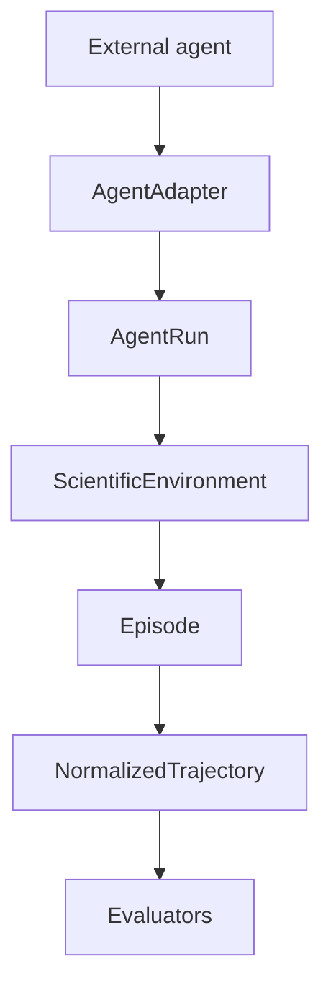

# Agent harness and decision trajectories

The harness is the compatibility boundary between an external agent framework
and `agent-evals`. Benchmarks and evaluators consume normalized `AgentRun`
objects; they never import OpenHands, OpenAI Agents, Claude, Codex, or another
provider directly.



## Adapter contract

An adapter implements:

```python
async def run(
    task: TaskSpecification,
    environment: ScientificEnvironment,
    configuration: AgentConfiguration,
) -> AgentRun
```

The adapter owns provider setup, session wiring, raw event capture, and
termination detection. It does not calculate scientific scores or modify the
benchmark definition.

`MockAgentAdapter` is the deterministic reference implementation. It is used
for tests and local vertical slices without requiring an LLM. `OpenHandsAdapter`
is optional and unavailable-safe: the core package still imports and the CLI
still lists adapters when OpenHands is not installed. When the optional extra
is installed, it constructs an official OpenHands SDK `Agent` and `Conversation`
for each run, sends the benchmark task into the controlled workspace, executes
the conversation, captures `conversation.state.events`, and translates SDK
usage metrics into the provider-neutral run record. A session factory remains
available for controlled tests and custom deployments.

## Running with OpenHands

Install the matched SDK and tools packages:

```bash
uv sync --extra openhands
```

Configure the model through the standard OpenHands/LiteLLM environment
variables, then run a task:

```bash
set LLM_MODEL=anthropic/claude-sonnet-4-5-20250929
set LLM_API_KEY=your-provider-key
uv run agent-evals run --benchmark pbmc-cell-annotation --agent openhands --workspace runs/openhands/local
```

`--model`, `--provider`, and `--workspace` are also available as CLI options.
Live runs require a provider credential and may incur model usage charges;
normal tests and the mock adapter never call a model.

## Running with GPT or Claude

Install the provider SDKs only when you want live model runs:

```bash
uv sync --extra science --extra providers
```

Configure credentials with environment variables. Do not put keys in benchmark
YAML, manifests, or committed config files.

```bash
set OPENAI_API_KEY=your-openai-key
uv run agent-evals run --benchmark pbmc-cell-annotation --agent openai --model gpt-5 --max-cells 120 --max-steps 4

set ANTHROPIC_API_KEY=your-anthropic-key
uv run agent-evals run --benchmark pbmc-cell-annotation --agent anthropic --model claude-sonnet --max-cells 120 --max-steps 4
```

Universal runtimes use the real scientific loop, so provider decisions execute
against the controlled Scanpy workspace and persist the same `agent_run.json`,
`trajectory.json`, `actions.json`, `metrics.json`, and report artifacts as
other scientific runs. `OPENAI_BASE_URL` and `ANTHROPIC_BASE_URL` are supported
for compatible deployments; API keys are passed only to SDK constructors and are
not copied into agent manifests.

## Raw traces and normalized trajectories

Raw events preserve the source framework's original payload and event type.
`DefaultTraceNormalizer` maps only observable interactions—messages,
observations, tool calls, tool results, commands, artifacts, and errors—into
the shared `EventType` vocabulary. Unknown events remain conservatively
classified rather than being interpreted as hidden reasoning.

Environment events are represented in the same normalized stream. This makes a
run's causal structure inspectable without forcing every provider to expose the
same internal event model.

## Scientific decisions and cascades

`ScientificDecision` is intentionally more meaningful than a generic tool
call. It records the observable action category, method, parameters,
rationale, inputs, outputs, execution status, and optional parent/dependency
relationships. `DecisionCascade` validates the hierarchy and rejects cycles.

The current extractor records explicit decisions from structured `ActionIntent`
metadata and environment results. It does not store private chain-of-thought or
ask an LLM to judge every command. Richer semantic extraction can be added as a
future normalizer without changing `AgentRun`.

## Persisted runs

Both `AgentRun` and `NormalizedTrajectory` support JSON round-tripping. A run
contains adapter/configuration metadata, benchmark and episode identity,
timestamps, optional token/cost information, raw events, normalized events,
decision cascades, artifacts, final environment state, and structured failures.
Partial runs remain valid persisted data.

```bash
agent-evals run --benchmark pbmc-cell-annotation --agent mock
```

The command writes a JSON run under `runs/` by default. The OpenHands path uses
the same `AgentRun` shape, including raw SDK events, normalized trajectory,
workspace metadata, token usage, cost when reported, and structured failures.
