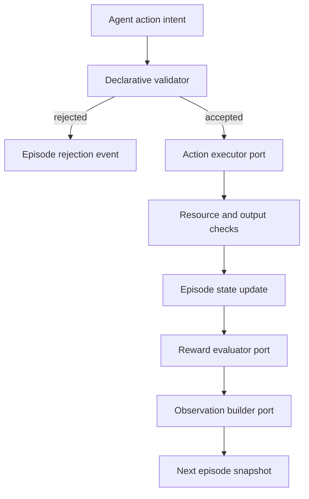

# Scientific environment and episodes

The environment is the runtime world an agent interacts with. It consumes a
validated benchmark specification and exposes only typed observations and
typed action intents. It does not contain Scanpy calls, dataset download code,
or a particular sandbox implementation.



## Episode as the research unit

An `Episode` records the benchmark ID and version, specification digest, task,
dataset selection, random seed, observations, action history, artifacts,
rewards, resource usage, timestamps, and an append-only event trace. The
episode snapshot is the object to persist, replay, debug, and later analyze as
an agent trajectory.

Invalid intents are recorded as rejection events without advancing the step.
Accepted actions advance the step even when execution fails, preserving the
failure in the trace. Failed actions do not commit output artifacts or
observations, and the episode remains recoverable until explicitly terminated.

## Stable runtime ports

- `ActionExecutor` maps a validated `ActionIntent` to an
  `ActionExecutionResult`. It may later be backed by a local process,
  container, remote worker, or simulator.
- `ObservationBuilder` derives agent-visible values from a snapshot without
  mutating episode state directly.
- `RewardEvaluator` computes metrics and rewards. The environment orchestrates
  this call but does not embed scientific scoring logic.
- `ConstraintMonitor` checks cumulative resource usage and prevents invalid
  outputs from being committed.

This separation makes the environment framework-agnostic and allows the next
phase to add concrete scientific tool adapters without changing episode or
benchmark contracts.

## Minimal usage

```python
environment = ScientificEnvironment(
    specification,
    task_id="cell-annotation",
    executor=executor,
    observation_builder=observation_builder,
    reward_evaluator=reward_evaluator,
)

initial = await environment.reset(seed=42, dataset_id="pbmc68k")
step = await environment.step(
    ActionIntent(action_id="qc", parameters={"min_genes": 200})
)
final = environment.terminate(reason="task complete")
```

The executor receives an `ExecutionContext` containing a deep episode snapshot
and declarative constraints. It never receives a mutable reference to the
environment's internal state.
