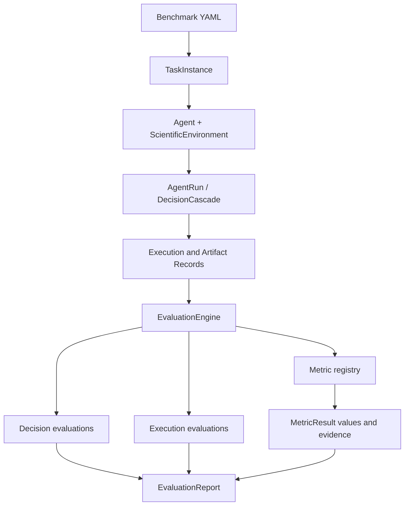

# Scientific task evaluation

The evaluation layer answers two different questions:

```text
WHAT THE AGENT DID  !=  HOW GOOD IT WAS
```

The agent trajectory records observable actions, methods, parameters,
execution results, and artifacts. The evaluator applies deterministic criteria
to that record. A single trajectory can therefore be evaluated repeatedly with
different metric registries without changing the run itself.



## Scientific tasks and task instances

`TaskSpecification` is the declarative benchmark contract. It names the
objective, datasets, legal actions, expected artifacts, workflow stages, and
evaluation configuration. A `TaskInstance` resolves those references into the
concrete action, method, artifact, dataset, and metric definitions needed for
one run. Workflow stages are guidance and may be conditional; the environment
continues to enforce allowed actions and required inputs.

## Decisions, methods, and parameters

`ScientificDecision` describes an observable selection. It does not calculate
scientific quality or ask an LLM to judge rationale. Decision extraction
preserves a hierarchy:

```text
step selection
└── method selection
    └── parameter selection
```

`MethodChoice` and `ParameterChoice` retain selected IDs, values, types,
optional ranges, implementation metadata, source, and parent relationships.
Execution status and artifact IDs remain attached to the decisions that led to
them.

## Evaluation levels

The report keeps levels separate:

- Decision: whether an observable action selection was allowed.
- Method: method compatibility and method/result metrics.
- Parameter: whether observed values satisfy declared parameter constraints.
- Execution: success, failure, resource usage, and runtime.
- Artifact: presence, validity, schema indicators, and scientific result metrics.

The current engine does not collapse these into a global reward.

## Metric registry and dependencies

Metrics are registered independently from benchmark YAML:

```python
@metric_registry.register(
    "my-metric",
    name="My metric",
    description="A deterministic artifact diagnostic.",
    level=EvaluationLevel.ARTIFACT,
    direction=Direction.HIGHER_IS_BETTER,
    required_artifacts=("corrected-embedding",),
)
def compute_my_metric(context: MetricContext) -> MetricComputation:
    return MetricComputation(raw_value=0.8, artifact_ids=("corrected-embedding",))
```

The benchmark references only `my-metric`. Before computation, the evaluator
checks registered artifact dependencies. Missing dependencies produce a
structured `unavailable` result with `error: missing_artifact`; a failure in
one metric produces `error` while independent metrics continue.

## Current deterministic metrics

The built-in MVP metrics use recorded environment data and do not invent
scientific scores:

- `execution-success`: successful submitted actions divided by submitted actions.
- `artifact-validity`: expected artifacts present and marked validated.
- `cell-retention`: recorded cells-after divided by cells-before.
- `embedding-validity`: finite, positive-dimensional embeddings with observations.
- `batch-mixing`: one minus the same-batch neighbor fraction when labels and
  neighbors are recorded.
- `biology-conservation`: an executor-reported conservation diagnostic when
  available.
- `runtime`: recorded wall-clock duration.

Scientific executors can add richer metadata or optional Scanpy/scIB-backed
implementations later without changing the report schema. The base framework
does not require the single-cell ecosystem to be installed.

## Reports and CLI

Run the multi-step deterministic demo:

```bash
agent-evals run --benchmark pbmc-batch-correction --agent mock --mock-policy good --output json
```

The command persists the `AgentRun` and an evaluation report under `runs/`.
Use `--output markdown` for a readable Markdown report, or provide `--report`
to choose its path. Compare a deliberately invalid policy with:

```bash
agent-evals run --benchmark pbmc-batch-correction --agent mock --mock-policy bad --output markdown
```

Existing runs can be evaluated again without rerunning the agent:

```bash
agent-evals evaluate runs/<run-id>.json --benchmark pbmc-batch-correction --output json
```

`EvaluationReport` preserves raw metric values, normalized scores where a
normalization is defined, direction, status, evidence, artifact IDs, errors,
decision evaluations, execution evaluations, artifacts, and failures. It is
JSON round-trippable and deliberately retains enough information for future
global scoring strategies.

## Adding a new metric

1. Add a deterministic compute function under `agent_evals.evaluators`.
2. Register its ID, level, direction, and required artifact IDs.
3. Add a `MetricSpecification` entry to the benchmark YAML.
4. Reference the ID under the task's `evaluation.metrics` list.
5. Add focused tests for success, missing dependencies, invalid inputs, and
   metric failure isolation.

No Python code is placed in benchmark YAML. No LLM judge is required, and no
global reward is introduced in this phase. Future global scoring can consume
the independent `MetricResult` records after a scientific policy for
aggregation has been selected.
