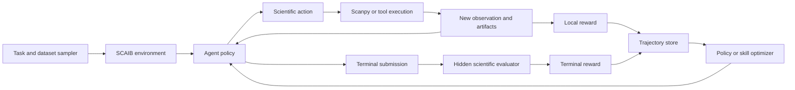

# SCAIB-RL: Reinforcement Learning Suite for Autonomous Single-Cell Analysis

SCAIB-RL is the training layer built on top of the SCAIB evaluation suite:

> **SCAIB-Eval measures agent behavior; SCAIB-RL uses those measurements to improve the agent.**

The repository already contains the beginnings of an RL-compatible environment: reset, step, observations, typed actions, rewards, termination, and replayable episodes. It does not yet contain a complete RL training system.

## Proposed RL Suite



## 1. Environment Suite

Each single-cell analysis becomes an episode:

- **State:** Visible dataset properties, metadata, previous results, artifacts, remaining budget, and analysis history.
- **Action:** Select an analysis step, method, parameters, tool call, or final submission.
- **Transition:** Execute the action and update the scientific workspace.
- **Termination:** Required artifacts are submitted, the agent stops, or the resource budget is exhausted.
- **Trajectory:** Every observation, decision, action, result, artifact, and reward is persisted.

The existing `ScientificEnvironment` provides this lifecycle through its `reset`, `step`, and `terminate` operations.

## 2. Task and Curriculum Suite

Training tasks should progress from short, verifiable decisions to complete analyses:

1. QC threshold selection
2. Normalization and highly variable gene selection
3. Integration-method selection
4. Clustering and resolution selection
5. Cell annotation
6. Differential-expression design
7. Complete PBMC workflows
8. Held-out tissues and technologies
9. Long-horizon biological conclusions

The curriculum should vary dataset size, noise, batch structure, rare populations, experimental design, and available tools.

## 3. Reward Suite

The RL suite should use **reinforcement learning with verifiable rewards (RLVR)** because most scientific outputs can be checked deterministically.

### Local Shaping Reward

Local rewards should measure improvement rather than reward a metric in isolation:

$$
r_t =
\eta\left[\Phi(s_{t+1})-\Phi(s_t)\right]
-\lambda_f I_{\mathrm{failure}}
-\lambda_i I_{\mathrm{invalid}}
-\lambda_c C_t
$$

Where:

- $\Phi(s)$ is the scientifically validated quality of the current state.
- $I_{\mathrm{failure}}$ penalizes failed execution.
- $I_{\mathrm{invalid}}$ penalizes prohibited or malformed actions.
- $C_t$ accounts for time, memory, tokens, and tool calls.

Using the change in quality helps prevent the agent from repeatedly performing an already rewarded action.

### Terminal Reward

The primary reward should remain the final scientific outcome:

$$
R_T =
G_{\mathrm{integrity}}
\times
S_{\mathrm{science}}
\times
S_{\mathrm{decision}}
\times
S_{\mathrm{trajectory}}
-\lambda_b C_{\mathrm{total}}
$$

This follows the existing multiplicative global score:

```text
scientific_outcome * decision_quality * trajectory_quality
```

The terms are:

- $G_{\mathrm{integrity}}$: Zero if required artifacts are missing, hidden data are accessed, or policy constraints are violated.
- $S_{\mathrm{science}}$: Terminal biological result quality.
- $S_{\mathrm{decision}}$: Appropriateness of observable methods and parameters.
- $S_{\mathrm{trajectory}}$: Consistency, adaptation, efficiency, and reproducibility.
- $C_{\mathrm{total}}$: Total resource cost.

Terminal reward should dominate training. Local rewards should help with credit assignment but should never allow an agent with an incorrect final result to receive a high total return.

## 4. Rollout and Trajectory Suite

Every rollout should save:

- benchmark and dataset versions;
- model, prompt, scaffold, tools, and skills;
- observations and structured decisions;
- method and parameter selections;
- action results and scientific artifacts;
- local and terminal reward components;
- resource usage;
- random seed and reproducibility metadata.

The existing `AgentRun` representation can become the canonical trajectory format. A new rollout manager would execute many episodes concurrently and write them to a versioned trajectory buffer.

## 5. Training Suite

There are two distinct optimization tracks.

### Open-Weight Model Training

For models whose weights can be updated:

1. Generate expert and high-scoring trajectories.
2. Perform supervised fine-tuning on valid decisions and tool use.
3. Apply GRPO or PPO using SCAIB's verifiable rewards.
4. Evaluate every checkpoint on hidden datasets and seeds.
5. Reject checkpoints that improve training reward while reducing held-out scientific performance.

### Closed-Model System Optimization

For GPT, Claude, and other API models, the weights cannot be trained directly. Instead, optimize:

- prompts;
- skill bundles;
- tool descriptions;
- workflow policies;
- memory structure;
- agent roles;
- orchestration strategies.

This can use evolutionary search, contextual bandits, Bayesian optimization, or rejection sampling over complete agent configurations.

## 6. Counterfactual Suite

The most valuable later component is branching replay:

```text
Observed decision: Harmony integration
Alternative 1: scVI
Alternative 2: Scanorama
Alternative 3: no integration
```

Each alternative is executed from the same checkpoint. This produces empirical decision regret:

$$
\operatorname{regret}(a_t)
=
\max_{a \in A_t} R(a)-R(a_t)
$$

This provides stronger training data than simply labeling a final workflow as successful or unsuccessful. Counterfactual execution is not implemented yet.

## 7. Dataset Splits and Reward-Gaming Controls

The RL suite should protect scientific validity through:

- train, development, and test splits separated by study, donor, tissue, and technology;
- hidden reference labels and evaluator-only artifacts;
- frozen reward profiles and metric applicability rules;
- no candidate-specific weight renormalization;
- isolated evaluator execution;
- repeated runs across seeds;
- adversarial and corrupted-input tasks;
- paired comparison against fixed pipeline and human baselines;
- explicit integrity gates for hidden-data access and sandbox violations.

Dense local rewards must not expose hidden reference information or become easier optimization targets than the terminal scientific objective.

## 8. Current Implementation Status

| Component | Current status |
| --- | --- |
| Typed `reset` and `step` environment | Implemented |
| Observable actions and decisions | Implemented |
| Replayable episode traces | Implemented |
| Local reward records | Implemented, but currently basic |
| Terminal scientific score | Implemented |
| Artifact and resource tracking | Implemented |
| Rollout workers | Missing |
| Training trajectory buffer | Missing |
| SFT, GRPO, or PPO integration | Missing |
| Curriculum scheduler | Missing |
| Policy checkpoint registry | Missing |
| Counterfactual branching | Missing |
| Reward-gaming tests | Missing |
| Held-out RL train, development, and test splits | Missing |
| Publication-scale agent training | Missing |

The current step reward is primarily based on mitochondrial-quality improvement, cell retention, and execution success. This is sufficient for testing the interface, but it is not scientifically broad enough for RL training.

## Paper-Level Description

> **SCAIB-RL is a single-cell RLVR suite that converts versioned SCAIB benchmarks into interactive training environments, using objective stage-level feedback, independently evaluated terminal biological outcomes, replayable decision trajectories, and counterfactual execution to train or optimize autonomous scientific agents.**

## Relevant Implementation Files

- `src/agent_evals/environment/runtime.py`
- `src/agent_evals/environment/models.py`
- `src/agent_evals/evaluators/rewards.py`
- `src/agent_evals/evaluation/local_rewards.py`
- `src/agent_evals/evaluation/global_score.py`
- `src/agent_evals/environment/scientific_loop.py`
- `docs/metric-evaluation.md`
